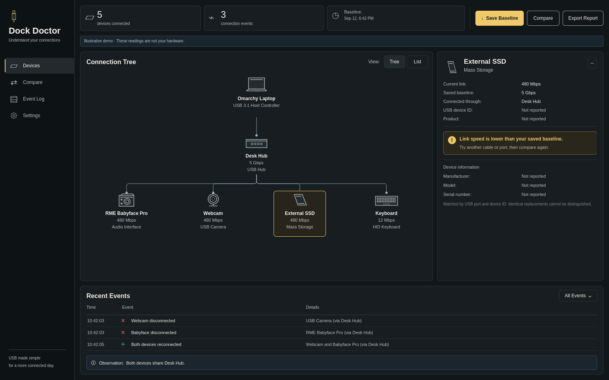

# Dock Doctor

A native Omarchy utility for understanding USB connections, reviewing observed
disconnects, and comparing negotiated link speeds with a saved working baseline.



The screenshot uses the explicitly labeled **illustrative demo**. Normal startup
shows the devices Linux actually reports on your machine.

## Install

Requires Omarchy Quattro, Python **3.11+**, and Linux. There are no additional Python
packages, network services, privileged helpers, or service installation steps.
The optional system `udevadm` executable wakes the observer after USB events;
a two-second scan also refreshes the inventory.

```bash
omarchy plugin add https://github.com/Kb2uka/omarchy-dock-doctor.git --enable
```

Click the USB icon in the bar to open the application window, or run:

```bash
omarchy-shell kb2uka.dock-doctor open
```

Move the widget with `omarchy bar move kb2uka.dock-doctor --section right`.
Escape or the window close control closes the window; the enabled plugin continues
observing connections.

## Use

- **Devices:** follow the connection tree, select a device, or switch to the list.
  Larger trees scroll without shrinking labels. The connected count includes hubs
  and peripherals, but excludes root controllers.
- **Save Baseline:** save the current inventory when your setup works as expected.
  Replacing an existing baseline requires confirmation.
- **Compare:** see current and saved link speeds, unidentified devices, and
  baseline devices that are no longer connected.
- **Event Log:** filter observed connections, disconnects, and link-speed changes.
- **Export Report:** save a JSON report locally. The result message includes its path.
- **Settings:** pause or resume retained history, clear events with confirmation,
  or explore an isolated illustrative demo.

### What the readings mean

The speed is the **negotiated USB link speed**, not measured transfer throughput.
A 480 Mbps audio interface or webcam is not faulty because it uses USB 2.0.
A slower link than a saved baseline is an observation, not a cable diagnosis.
No health percentages, bandwidth-utilization estimates, or automatic repairs are provided.

Serial identity is preferred. Without a serial number, comparisons use the USB
controller's physical path, port, and vendor/product ID. An identical replacement
on the same port cannot be distinguished. Duplicate identities are marked
ambiguous and never receive a confident speed comparison. Missing attributes say
**Not reported**.

Events record differences between observed inventories. Short disconnect/reconnect
cycles between scans can be missed, even with event-triggered refreshes. Events
while the plugin is disabled are not reconstructed. A scan failure retains the last
inventory with an error, and recovery starts a fresh observation interval.
Shared-parent observations identify devices disappearing in the same scan; they
do not establish the hub as the cause.

This version inspects USB connections. It does not diagnose DisplayPort, charging
contracts, Thunderbolt authorization, or actual data-transfer performance.

## Privacy and retained state

The plugin makes **no network requests** and does not write hardware settings.
At most 300 events and one baseline are retained in:

```text
~/.local/state/dock-doctor/state.json
```

`XDG_STATE_HOME` is respected when supplied as a safe absolute directory.
Reports are saved beside the state file as `report-<random>.json`.
Reports omit serial-number fields and identity hashes. Device names, vendor/product
IDs, speeds, event timestamps, and descriptive text remain; inspect a report before
sharing it. Exports are user-requested and are not automatically deleted.

All persistent writes reuse the descriptor-relative filesystem protections developed
for [Babyface Control](https://github.com/Kb2uka/Omarchy-Plugins/pull/1): checked directory
ownership, no-follow reads, bounded regular files, exclusive private temporary files,
and checked atomic replacement. Unsafe or corrupt retained state is left untouched
and reported. A lock prevents simultaneous observers from overwriting each other's data.
See [SECURITY.md](SECURITY.md).

## Update and remove

```bash
omarchy plugin update kb2uka.dock-doctor
omarchy plugin disable kb2uka.dock-doctor
omarchy plugin remove kb2uka.dock-doctor
```

Disabling/removing the plugin stops its observer. The event monitor is tied to the
observer with a Linux parent-death signal, so abrupt shell shutdown cannot leave it running. Baselines, history, and exported
reports remain yours in the state directory. No desktop keybindings or system
services are installed.

## Read-only command line

From the repository directory:

```bash
/usr/bin/python3 -I dock-doctor.py scan
```

This prints the current inventory without reading or writing retained state.
`watch` is the shell's line-oriented observer protocol; it exits when its input
closes. Its commands are fixed JSON actions: `refresh`, `save-baseline`, `export`,
`recording` (with a boolean `enabled`), and `clear-events`.

## Development

The application view is ordinary Qt Quick; the small plugin entry point hosts it
in a native Quickshell window. Python discovery, comparison, state, and process
lifecycle are separate modules. No web view or browser runtime is involved.

```bash
python3 -m unittest discover -s tests -p 'test_*.py'
bash tests/ui/run.sh
omarchy plugin validate .
```

The native lifecycle check uses an isolated headless Weston compositor:
`bash tests/ui/native-parse.sh`. It requires Weston and the installed Omarchy shell.
The maintainer's development suites run on remote Linux hosts, not the XPS.
Linux x64 and arm64 backend checks run in CI; physical arm64 USB hardware remains
an additional validation target.

MIT license. Copyright KB2UKA.
